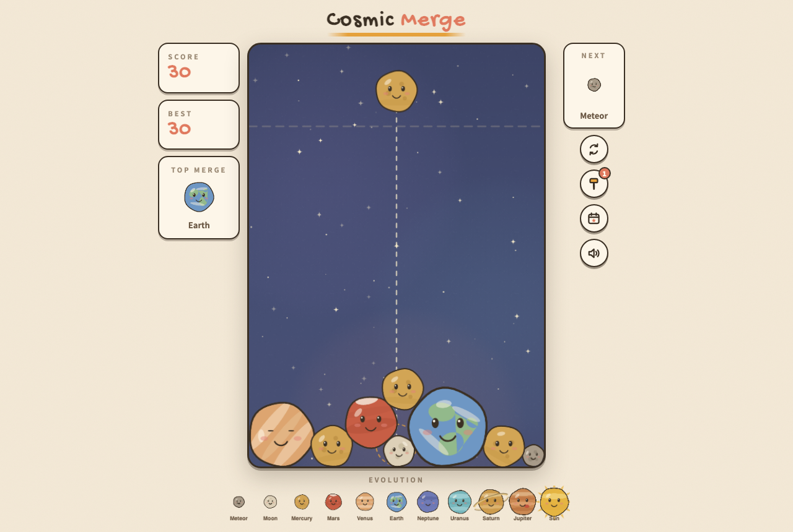

# 宇宙合併 Cosmic Merge ☀️

手繪紙感（cozy paper）風格的西瓜遊戲式物理合成遊戲——
把可愛的星球丟進繪本夜空，兩顆相同的星球碰在一起就會合體升級，從小隕石一路合到太陽！

A Suika-style physics merge game with a hand-drawn cozy paper aesthetic.
Drop cute planets into a storybook night sky and merge your way from Meteor to the Sun.



**▶️ 線上試玩：https://jeffrey5304lab.github.io/cosmic-merge/**

## 特色 Features

- 🪐 **11 級進化鏈**：隕石 → 月球 → 水星 → 火星 → 金星 → 地球 → 海王星 → 天王星 → 土星 → 木星 → **太陽**
- ✍️ **手繪紙感美術**：抖動墨水邊線、紙剪陰影、水彩星雲、紙張顆粒，全程 Canvas 自繪零素材
- ⚡ **連鎖 COMBO**：1.5 秒內連續合成，倍率最高 ×8，配衝擊波 + 粒子 + 螢幕震動
- 😊 **會表情的星球**：每顆臉孔略有不同並各自眨眼；合併綻放笑容噴火花、接近頂線冒汗緊張、被一堆星球包圍會瞇眼咬牙、太久沒投則半垂眼不耐煩、偶爾還會打哈欠
- 🏆 **全球排行榜**：結算輸入暱稱與國家送出分數，顯示全球前 10、🥇🥈🥉 獎牌、你的名次與「再 N 分超越上一名」；遊戲中可隨時開排行榜（會暫停）並用 🌍 全球 / 🇹🇼 我的國家 分頁切換。已接 Supabase，未設定則自動退回本機排行榜
- ⭐ **成就與統計**：13 項成就（階級／連鎖／分數／場數／合成里程碑），解鎖跳提示；終身統計（場數、最高分、最高星球、最佳連鎖、總合成數、太陽數）
- 📸 **成績分享卡**：一鍵生成手繪風成績圖，原生分享（手機）或下載（桌面）
- 💫 **復活機制**：每局一次，看（模擬）廣告清掉上方星球續玩——獎勵式廣告位已就緒
- 🔨 **道具**：小錘子敲掉任一顆星球（看廣告獲得）
- 🎵 **生成式 lo-fi BGM**：WebAudio 和弦墊 + 五聲音階撥弦，零音檔
- 📱 **觸控 / 滑鼠 / 鍵盤**全支援、合成觸覺震動、PWA 離線可玩（Service Worker）

> 廣告皆走 `src/ads.ts` 抽象層，目前是 Mock 實作；上線接 AdMob / H5 Games Ads 只需替換一個 Provider。

## 操作 Controls

| 操作 | 桌面 | 手機 |
|---|---|---|
| 瞄準 | 移動滑鼠 / ← → | 拖曳 |
| 投放 | 點擊 / 空白鍵 | 放開 |

星球堆超過上方虛線 1.2 秒遊戲結束。

## 開發 Development

```bash
npm install
npm run dev      # 開發伺服器
npm test         # vitest（29 tests：純邏輯 + 無頭物理整合）
npm run build    # 產線建置（tsc + vite）
node scripts/screenshot.mjs   # Playwright 截圖驗收（需全域 playwright）
```

## 技術 Tech

| 面向 | 選擇 |
|---|---|
| 建置 | Vite 5 + TypeScript（嚴格模式） |
| 物理 | matter-js（碰撞、堆疊、合成偵測） |
| 渲染 | Canvas 2D 手繪風自繪（抖動邊線 + 紙剪陰影 + 表面紋理） |
| 音效 | WebAudio 合成（零音檔素材） |
| 測試 | Vitest 單元 + 無頭物理整合測試、Playwright E2E 驗收 |
| 儲存 | localStorage（最佳紀錄 / 排行榜 / 道具庫存 / 偏好），選配 Supabase（全球排行榜） |

架構分層：**純邏輯**（`logic.ts`、`planets.ts`、`leaderboard.ts`）零 DOM 依賴可直接單測；
**物理與渲染**（`game.ts`、`render.ts`）；**UI 接線**（`main.ts`、`strings.ts`）。

## Roadmap

- [x] 部署上線（GitHub Pages）
- [x] Service Worker 完整離線
- [x] 線上排行榜（已接 Supabase 並在正式站啟用；設定見 [docs/SUPABASE_SETUP.md](docs/SUPABASE_SETUP.md)）
- [x] 排行榜進階：獎牌、本局名次與差距、國家國旗 + 國家分頁（國旗需執行一次 `alter table scores add column country text;` 才會顯示，未建欄位時自動退回無國旗）
- [ ] Capacitor 包裝 iOS / Android App
- [ ] 星球皮膚主題（水果、甜點、貓咪）

## License

MIT
